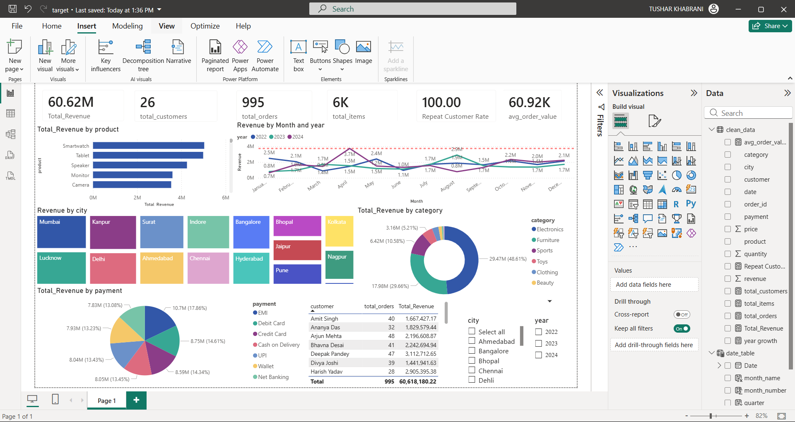

# 🏪 Retail Store Sales Analysis & Dashboard

  

Complete data analytics pipeline for retail store transactional data
(FY 2022–2024) — from raw data validation and cleaning in MySQL to
an interactive Power BI dashboard delivering actionable business insights.

---

## 📦 Dataset Overview

| Attribute | Value |
|---|---|
| Data Period | FY 2022 – 2024 |
| Raw File | dirty_dataset.xlsx · raw_data.csv |
| Columns | order_id · date · product · category · price · quantity · customer · city · payment |
| Categories | Electronics · Furniture · Sports · Toys · Clothing · Beauty |
| Cities | Mumbai · Kanpur · Surat · Indore · Bangalore · Delhi · Ahmedabad · Chennai · Hyderabad · Lucknow · Pune · Nagpur · Jaipur · Kolkata |

---

## 📊 Key KPIs

| Metric | Value |
|---|---|
| Total Revenue | ₹60.62M (₹6.06 Cr) |
| Total Orders | 995 |
| Total Customers | 26 |
| Avg Order Value | ₹60.92K |
| Repeat Customer Rate | 100% (zero churn) |
| Top Category | Electronics (48.61%) |
| Top Product | Smartwatch (₹50.3L · 8.3%) |
| Peak Month | April (₹67.2L) |
| Top Customer | Deepak Pandey (₹31.1L · 47 orders) |

---

## 💡 Key Insights

- **Electronics dominated** — 48.61% of total revenue (₹29.47M); Furniture 2nd at 29.66% (₹17.98M)
- **All top 5 products from Electronics** — Smartwatch ₹50.3L · Tablet ₹49.9L · Speaker ₹43.2L · Monitor ₹41.8L · Camera ₹38.5L
- **April peak at ₹67.2L** — 12% above next highest month, driven by India's new financial year budget cycle
- **Predictable seasonal spikes** — Revenue peaks every April, October (Diwali) & December across all 3 years
- **100% repeat customer rate** — All 26 customers are repeat buyers; business appears B2B or niche high-loyalty
- **Deepak Pandey** — top buyer at ₹31.1L across 47 orders
- **Stable YoY growth** — gradual revenue increase from 2022 to 2024 with no major drops
- **Anomalies flagged:** 10 NULL order dates (₹6.4L revenue excluded) · 51 duplicate order IDs · Unknown payment type entries

---

## 🔍 SQL Analysis

**Phase 1 — Data Validation (validation.sql)**
- NULL checks across all 9 columns
- Empty string detection via TRIM()
- Invalid price and quantity detection (≤ 0)
- Date format validation — STR_TO_DATE() check
- Duplicate order_id detection via GROUP BY + HAVING
- Distinct payment method check

**Phase 2 — Data Cleaning (validation.sql)**
- Created `clean_data` table with:
  - 5 date format normalizations using CASE + STR_TO_DATE()
  - 6+ misspelled categories fixed (electrnics → Electronics, sprots → Sports, beuty → Beauty, etc.)
  - 7 payment methods standardized via LIKE pattern matching (Cash on Delivery, Credit Card, Debit Card, Net Banking, EMI, UPI, Wallet)
  - NULL/empty customer and city replaced with 'Unknown'
  - price CAST to DECIMAL(10,2) · quantity CAST to UNSIGNED
  - revenue = price × quantity computed as derived column
  - Invalid records filtered (price ≤ 0, quantity ≤ 0 or > 100, NULL date/product/category)

**Phase 3 — Business Analysis (analysis.sql)**
- Total revenue, avg order value, total orders, total customers, total items
- Repeat customer identification
- Product-wise revenue ranking
- Monthly sales trend using CTE + COALESCE for NULL date handling
- Category-wise revenue with % share
- Customer behavior — top customers by spend and order count
- Payment method distribution with revenue %
- City-wise sales and revenue
- Daily sales spike detection

---

## 📈 Power BI Dashboard

### Retail Store Sales Dashboard

KPI cards: ₹60.62M revenue · 26 customers · 995 orders · 6K items · 100% repeat rate · ₹60.92K AOV

Revenue by product (Smartwatch leads at ₹4M+) | Revenue by Month & Year (2022–2024 trend lines) | Revenue by city (treemap — Mumbai · Kanpur · Surat) | Category donut (Electronics 48.61% · Furniture 29.66%) | Payment method pie (EMI · Debit Card · Credit Card · Cash on Delivery · UPI · Wallet · Net Banking) | Top customers table with total orders & revenue | Filters: city · year (2022/2023/2024)

---

## 📄 Business Insights Report

[📄 Business Insights Report](Retail-store/report/Business_Insights_Report%20(1).pdf)

Key findings covered:
- Top 5 products by revenue with % share
- Peak month analysis with business reasoning
- Customer loyalty and churn analysis
- Anomalies detected and actionable recommendations

---

## 📁 Project Structure

    retail-store-sales-analysis/
    ├── sql/
    │   ├── validation.sql
    │   └── analysis.sql
    ├── data/
    │   ├── raw_data.csv
    │   ├── dirty_dataset.xlsx
    │   └── clean_data.csv
    ├── dashboards/
    │   ├── retail_dashboard.pbix
    │   └── screenshots/
    │       └── dashboard_overview.png
    ├── report/
    │   └── Business_Insights_Report.pdf
    ├── requirements.txt
    └── README.md

---

## ▶️ How to Run

1. Clone: `git clone https://github.com/Tushar-Khabrani/retail-store-sales-analysis`
2. Import `data/raw_data.csv` into MySQL as `raw_data` table
3. Run `sql/validation.sql` → creates `clean_data` table
4. Run `sql/analysis.sql` → all business analysis queries
5. Open `dashboards/retail_dashboard.pbix` in Power BI Desktop

---

## 🤖 AI Integration
Used **Claude (Anthropic)** to optimize SQL queries, assist with DAX
formula logic in Power BI, and structure the business insights report.
All analytical conclusions, KPI selection, and dashboard design
decisions independently made and validated.

---

## 🛠️ Tech Stack

`MySQL` · `Power BI` · `DAX` · `ETL` · `Data Cleaning`
`Window Functions` · `CTEs` · `Business Intelligence`

**Domain:** Retail Analytics · Business Intelligence · Dashboarding

---

## 👤 Author
**Tushar Khabrani** — [LinkedIn](https://www.linkedin.com/in/tusharkhabrani104) · [GitHub](https://github.com/Tushar-Khabrani)
